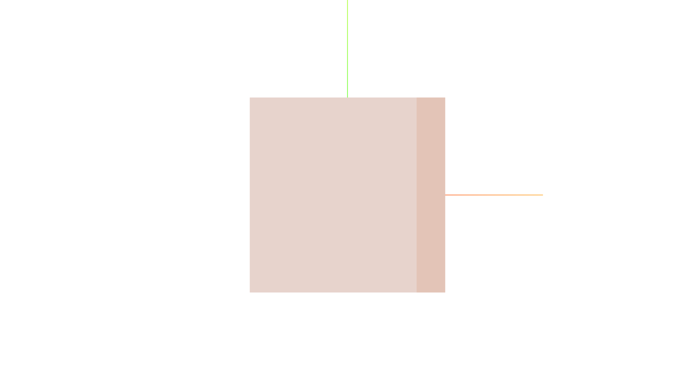
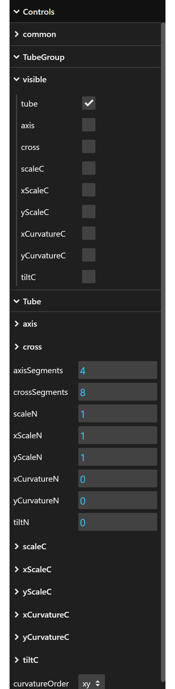

[English](guide.md) | [日本語](guide.jp.md)

# Guide to the hair bundle web page

The hair bundle web page consists of three parts: Scene, Viewport gizmo, and Control panel.

## Scene

[Scene](https://threejs.org/docs/#Scene) is where 3D objects are placed. By default, a light brown cylinder and [AxesHelper](https://threejs.org/docs/#AxesHelper) are placed in the scene. The scene is rendered through [OrthographicCamera](https://threejs.org/docs/#OrthographicCamera). The camera's field of view is adjusted to match the window size. You can control the camera as follows:

- Drag the left mouse button to rotate around the pivot point. The camera always points towards the pivot point. By default, the pivot point is the origin.
- Drag the right mouse button to move parallel to the screen.
- Roll the mouse wheel to zoom in/out.

These camera controls come from [OrbitControls](https://threejs.org/docs/#OrbitControls).

## Viewport gizmo

The viewport gizmo is a library called [THREE Viewport Gizmo](https://fennec-hub.github.io/three-viewport-gizmo/). The viewport gizmo displays the XYZ directions. Clicking on the X,Y,Z circles or the blank -X,-Y,-Z circles will rotate the camera in that direction, just like dragging the left mouse button in the scene. 

## Control panel

The control panel is a library called [lil-gui](https://lil-gui.georgealways.com/). The control panel consists of folders and controllers. A folder can contain folders and controllers. Clicking a folder opens or closes it, showing or hiding its contents. A controller can be a dropdown, checkbox, text field, number field, color field, or button.

Number fields can also be modified by dragging the left mouse button or by pressing the up or down arrow keys when the field has focus. While making changes using these methods, holding down the Shift key increases the value step size, and holding down the Alt key decreases the value step size.

Every time you operate the control panel, its current state is saved in a state array. To revert to the previous state, press Ctrl+z (Cmd+z on Mac). To advance to the next state, press Shift+Ctrl+z or Ctrl+y (Shift+Cmd+z or Cmd+y on Mac).

The control panel contains the following items.

| Name                    | Description |
| ----------------------- | ----------- |
| common                  | Shareable items. |
| --THREE.Scene           | A scene in which to place 3D objects. Link: https://threejs.org/docs/#Scene |
| ----background          | The background color of the scene. |
| --THREE.AxesHelper      | Axes helper with XYZ axes. Link: https://threejs.org/docs/#AxesHelper |
| ----visible             | Whether to display the axes helper. |
| ----size                | The length of each line for the axes helper. Step: 0.01 |
| --THREE.Material        | The appearance of 3D objects. Link: https://threejs.org/docs/#Material |
| ----points              | The appearance of point objects. This is used for control points. Link: https://threejs.org/docs/#PointsMaterial |
| ------color             | Point color. |
| ------size              | Point size in pixels. Min: 0, Max: 10, Step: 0.01 |
| ------opacity           | Point opacity. Min: 0, Max: 1, Step: 0.01 |
| ----line                | The appearance of line objects. This is used for control points and curves. Link: https://threejs.org/docs/#LineBasicMaterial |
| ------color             | Line color. |
| ------opacity           | Line opacity. Min: 0, Max: 1, Step: 0.01 |
| ----tube_(u=uniforms)   | The appearance of tube object. This is an original mesh toon material created from a shader material. It is set to render the both side. Link: https://threejs.org/docs/#ShaderMaterial |
| ------wireframe         | Whether to change the tube display to wireframe. |
| ------u.checkShape      | Whether to change the tube display to see the tube shape. As the face turns from front to back, the color changes from white to black. |
| ------u.light.x         | The x-coordinate of the light source for the tube. Step: 0.1 |
| ------u.light.y         | The y-coordinate of the light source for the tube. Step: 0.1 |
| ------u.light.z         | The z-coordinate of the light source for the tube. Step: 0.1 |
| ------u.threshold       | The shade threshold for the tube. The larger this value, the larger the area filled with the shade color. Min: 0, Max: 1, Step: 0.01 |
| ------u.baseColor       | The base color for the tube. |
| ------u.shadeColor      | The shade color for the tube. |
| TubeGroup               | A group containing tube-related objects. |
| --visible               | A collection of "{tube-related-object-name}.visible". |
| ----tube                | Whether to display the tube object. |
| ----axis                | Whether to display the 3D Cubic Bezier curve object for the tube axis. |
| ----cross               | Whether to display the 2D Cubic Bezier curve object for the tube cross-section. |
| ----scaleC              | Whether to display the 2D Cubic Bezier curve object representing the scale ratio variation of the tube cross-section. C stands for curve. |
| ----xScaleC             | Whether to display the 2D Cubic Bezier curve object representing the x-scale ratio variation of the tube cross-section. C stands for curve. |
| ----yScaleC             | Whether to display the 2D Cubic Bezier curve object representing the y-scale ratio variation of the tube cross-section. C stands for curve. |
| ----xCurvatureC         | Whether to display the 2D Cubic Bezier curve object representing the x-curvature variation of the tube cross-section. C stands for curve. |
| ----yCurvatureC         | Whether to display the 2D Cubic Bezier curve object representing the y-curvature variation of the tube cross-section. C stands for curve. |
| ----tiltC               | Whether to display the 2D Cubic Bezier curve object representing the tilt variation of the tube cross-section in degrees. C stands for curve. |
| Tube                    | Tube. |
| --axis                  | 3D Cubic Bezier curve of the tube axis. |
| ----addCpToFirst        |             |
| ----addCpToLast         |             |
| ----interpolateCp       |             |
| ----removeCp            |             |
| ----interoplateCp_index |             |
| ----removeCp_index      |             |
| ----cp[0,1,...]         | Indexed control point of the tube axis. It consists of three point objects and two line object connecting them. cp stands for control panel. |
| ------middle.x          | The x-coordinate of the middle point object. Changing this will also change "left.x" and "right.x" by the same amount. Step: 0.01 |
| ------middle.y          | The y-coordinate of the middle point object. Changing this will also change "left.y" and "right.y" by the same amount. Step: 0.01 |
| ------middle.z          | The z-coordinate of the middle point object. Changing this will also change "left.z" and "right.z" by the same amount. Step: 0.01 |
| ------left.x            | The x-coordinate of the left point object. Changing this will be reflected in "left.radius", "left.Ax", "left.Ay", and "left.Az" and will apply to all enabled syncs. Step: 0.01 |
| ------left.y            | The y-coordinate of the left point object. Changing this will be reflected in "left.radius", "left.Ax", "left.Ay", and "left.Az" and will apply to all enabled syncs. Step: 0.01 |
| ------left.z            | The z-coordinate of the left point object. Changing this will be reflected in "left.radius", "left.Ax", "left.Ay", and "left.Az" and will apply to all enabled syncs. Step: 0.01 |
| ------right.x           | The x-coordinate of the right point object. Changing this will be reflected in "right.radius", "right.Ax", "right.Ay", and "right.Az" and will apply to all enabled syncs. Step: 0.01 |
| ------right.y           | The y-coordinate of the right point object. Changing this will be reflected in "right.radius", "right.Ax", "right.Ay", and "right.Az" and will apply to all enabled syncs. Step: 0.01 |
| ------right.z           | The z-coordinate of the right point object. Changing this will be reflected in "right.radius", "right.Ax", "right.Ay", and "right.Az" and will apply to all enabled syncs. Step: 0.01 |
| ------isSyncRadius      | Whether to synchronize the left and right radii to be the same. |
| ------isSyncAngle       | Whether to synchronize the left and right angles so that the difference is 180 degrees. |
| ------local             | Subitems of the control point. |
| --------left.radius     | The relative coordinate distance from the middle point object to the left point object. Changing this will be reflected in "left.x", "left.y", and "left.z" and will apply to all enabled syncs. Min: 0, Step: 0.01 |
| --------left.Ax         | The relative coordinate angle (in degrees) around the x-axis from the middle point object to the left point object. The angle is 0 when (y,z)=(n,0),n>0, and increases counterclockwise in the yz plane. Changing this will be reflected in "left.x", "left.y", and "left.z" and will apply to all enabled syncs. A stands for angle. Step: 1 |
| --------left.Ay         | The relative coordinate angle (in degrees) around the y-axis from the middle point object to the left point object. The angle is 0 when (z,x)=(n,0),n>0, and increases counterclockwise in the zx plane. Changing this will be reflected in "left.x", "left.y", and "left.z" and will apply to all enabled syncs. A stands for angle. Step: 1 |
| --------left.Az         | The relative coordinate angle (in degrees) around the z-axis from the middle point object to the left point object. The angle is 0 when (x,y)=(n,0),n>0, and increases counterclockwise in the xy plane. Changing this will be reflected in "left.x", "left.y", and "left.z" and will apply to all enabled syncs. A stands for angle. Step: 1 |
| --------right.radius    | The relative coordinate distance from the middle point object to the right point object. Changing this will be reflected in "right.x", "right.y", and "right.z" and will apply to all enabled syncs. Min: 0, Step: 0.01 |
| --------right.Ax        | The relative coordinate angle (in degrees) around the x-axis from the middle point object to the right point object. The angle is 0 when (y,z)=(n,0),n>0, and increases counterclockwise in the yz plane. Changing this will be reflected in "right.x", "right.y", and "right.z" and will apply to all enabled syncs. A stands for angle. Step: 1 |
| --------right.Ay        | The relative coordinate angle (in degrees) around the y-axis from the middle point object to the right point object. The angle is 0 when (z,x)=(n,0),n>0, and increases counterclockwise in the zx plane. Changing this will be reflected in "right.x", "right.y", and "right.z" and will apply to all enabled syncs. A stands for angle. Step: 1 |
| --------right.Az        | The relative coordinate angle (in degrees) around the z-axis from the middle point object to the right point object. The angle is 0 when (x,y)=(n,0),n>0, and increases counterclockwise in the xy plane. Changing this will be reflected in "right.x", "right.y", and "right.z" and will apply to all enabled syncs. A stands for angle. Step: 1 |
| --cross                 | 2D Cubic Bezier curve of the tube cross-section. |
| ----addCpToFirst        |             |
| ----addCpToLast         |             |
| ----interpolateCp       |             |
| ----removeCp            |             |
| ----interoplateCp_index |             |
| ----removeCp_index      |             |
| ----cp[0,1,...]         | Indexed control point of the tube axis. It consists of three point objects and two line object connecting them. cp stands for control panel. |
| ------middle.x          | The x-coordinate of the middle point object. Changing this will also change "left.x" and "right.x" by the same amount. Step: 0.01 |
| ------middle.y          | The y-coordinate of the middle point object. Changing this will also change "left.y" and "right.y" by the same amount. Step: 0.01 |
| ------left.x            | The x-coordinate of the left point object. Changing this will be reflected in "left.radius" and "left.angle" and will apply to all enabled syncs. Step: 0.01 |
| ------left.y            | The y-coordinate of the left point object. Changing this will be reflected in "left.radius" and "left.angle" and will apply to all enabled syncs. Step: 0.01 |
| ------right.x           | The x-coordinate of the right point object. Changing this will be reflected in "right.radius" and "right.angle" and will apply to all enabled syncs. Step: 0.01 |
| ------right.y           | The y-coordinate of the right point object. Changing this will be reflected in "right.radius" and "right.angle" and will apply to all enabled syncs. Step: 0.01 |
| ------isSyncRadius      | Whether to synchronize the left and right radii to be the same. |
| ------isSyncAngle       | Whether to synchronize the left and right angles so that the difference is 180 degrees. |
| ------local             | Subitems of the control point. |
| --------left.radius     | The relative coordinate distance from the middle point object to the left point object. Changing this will be reflected in "left.x" and "left.y" and will apply to all enabled syncs. Min: 0, Step: 0.01 |
| --------left.angle      | The relative coordinate angle (in degrees) from the middle point object to the left point object. The angle is 0 when (x,y)=(n,0),n>0, and increases counterclockwise in the xy plane. Changing this will be reflected in "left.x" and "left.y" and will apply to all enabled syncs. Step: 1 |
| --------right.radius    | The relative coordinate distance from the middle point object to the right point object. Changing this will be reflected in "right.x" and "right.y" and will apply to all enabled syncs. Min: 0, Step: 0.01 |
| --------right.angle     | The relative coordinate angle (in degrees) from the middle point object to the right point object. The angle is 0 when (x,y)=(n,0),n>0, and increases counterclockwise in the xy plane. Changing this will be reflected in "right.x" and "right.y" and will apply to all enabled syncs. Step: 1 |
| --axisSegments          | The number of faces along the tube axis. Min: 1, Step: 1 |
| --crossSegments         | The number of faces in the tube cross-section. Min: 3, Step: 1 |
| --scaleN                | The scale ratio of the tube cross-section. N stands for number. Min: 0, Step: 0.01 |
| --xScaleN               | The x-scale ratio of the tube cross-section. N stands for number. Min: 0, Step: 0.01 |
| --yScaleN               | The y-scale ratio of the tube cross-section. N stands for number. Min: 0, Step: 0.01 |
| --xCurvatureN           | The x-curvature of the tube cross-section. N stands for number. Step: 0.01 |
| --yCurvatureN           | The y-curvature of the tube cross-section. N stands for number. Step: 0.01 |
| --tiltN                 | The tilt of the tube cross-section in degrees. N stands for number. Step: 1 |
| --scaleC                | 2D Cubic Bezier curve representing the scale ratio variation of the tube cross-section. The folder structure is the same as "cross" above. C stands for curve. |
| --xScaleC               | 2D Cubic Bezier curve representing the x-scale ratio variation of the tube cross-section. The folder structure is the same as "cross" above. C stands for curve. |
| --yScaleC               | 2D Cubic Bezier curve representing the y-scale ratio variation of the tube cross-section. The folder structure is the same as "cross" above. C stands for curve. |
| --xCurvatureC           | 2D Cubic Bezier curve representing the x-curvature variation of the tube cross-section. The folder structure is the same as "cross" above. C stands for curve. |
| --yCurvatureC           | 2D Cubic Bezier curve representing the y-curvature variation of the tube cross-section. The folder structure is the same as "cross" above. C stands for curve. |
| --tiltC                 | 2D Cubic Bezier curve representing the tilt variation of the tube cross-section in degrees. The folder structure is the same as "cross" above. C stands for curve. |
| --curvatureOrder        | The order in which x and y curvature are applied. If "xy" is selected, the curvature is applied in the order x, y. If "yx" is selected, the curvature is applied in the order y, x. |
