[English](tutorial.md) | [日本語](tutorial.jp.md)

# Tutorial

This tutorial will show you how to create a simple hair bundle on the hair bundle web page.

## Steps

First, open [the hair bundle web page](https://nut753908.github.io/costume-design/hair-bundle.html) in a new tab or new window. You will see a screen like this:

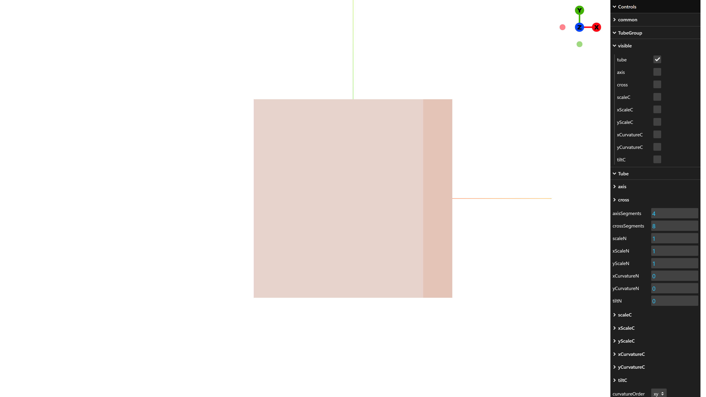

 

Check the "common > THREE.Material > tube (u=uniforms) > wireframe" checkbox to enable the wireframe display for the tube.

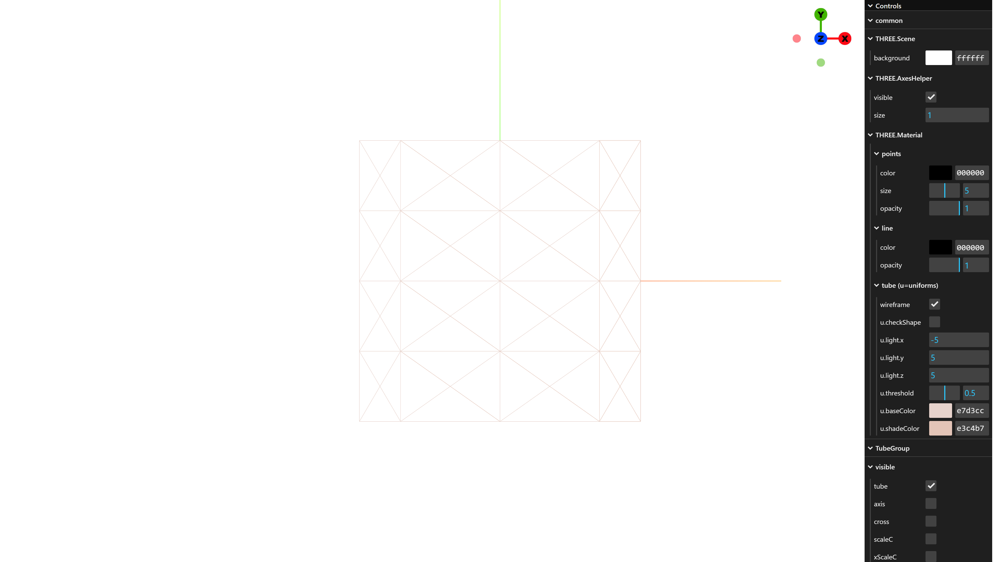

 

Set the value of "Tube > axisSegments" to 40 to increase the number of faces along the tube axis. Next, set the value of "Tube > crossSegments" to 20 to increase the number of faces in the tube cross-section.

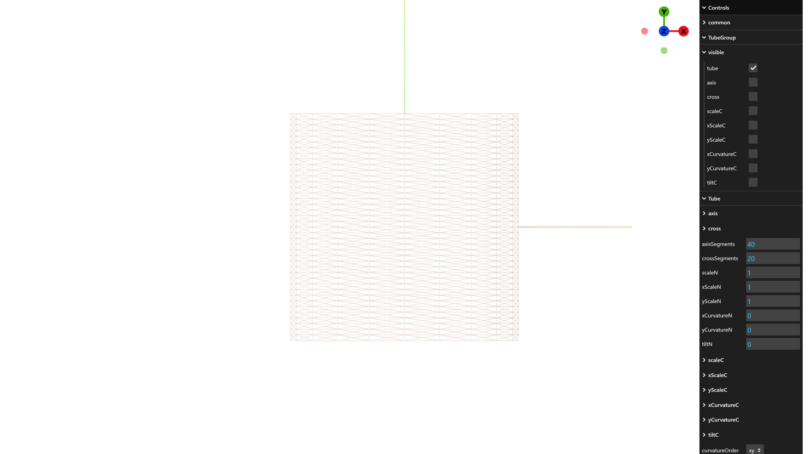

 

Set the value of "Tube > xScaleN" to 0.2 to reduce the x-scale of the tube cross-section. In reality, the z-scale of the tube cross-section appears to be reduced. Next, set the value of "Tube > yScaleN" to 0.02 to reduce the y-scale of the tube cross-section. In reality, the x-scale of the tube cross-section appears to be reduced.

 

Set the value of "Tube > yCurvatureN" to -4 to curve the tube cross-section in the -y direction. In reality, the tube cross-section appears to curve in the -x direction.

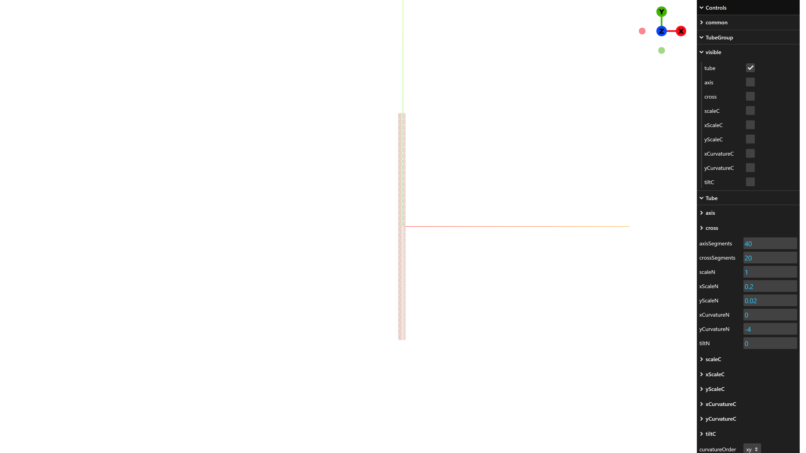

 

Uncheck the "common > THREE.Material > tube (u=uniforms) > wireframe" checkbox to disable the wireframe display for the tube.

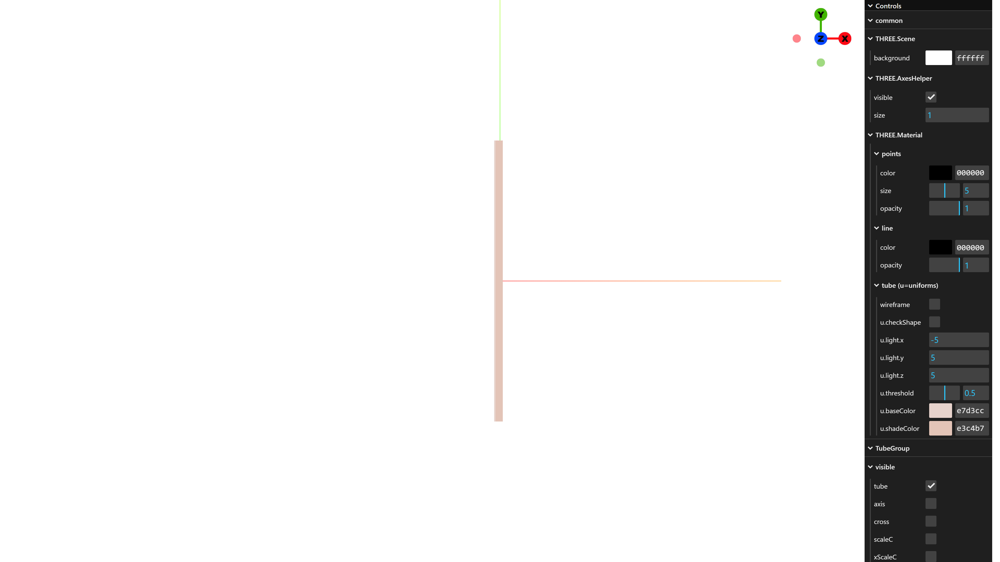

 

Check the "TubeGroup > visible > scaleC" checkbox to display the scale curve for the tube cross-section. Roll the mouse wheel to zoom out so that the entire scale curve is visible.

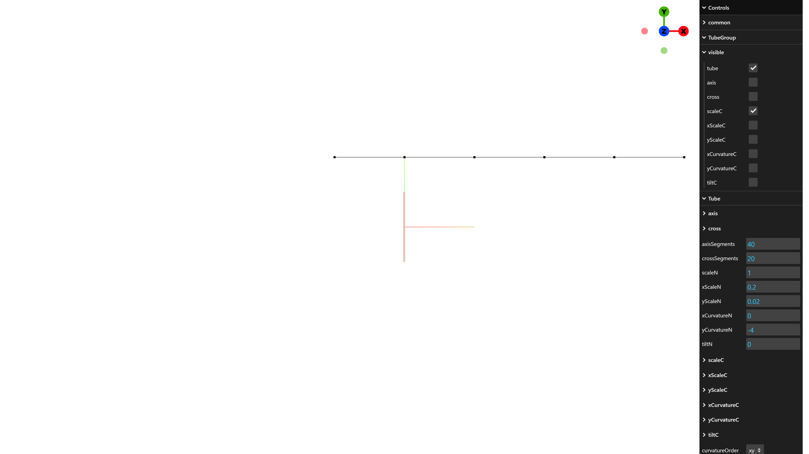

 

Select the "Tube > scaleC > interpolateCp" button to add an interpolated control point between the two control points.

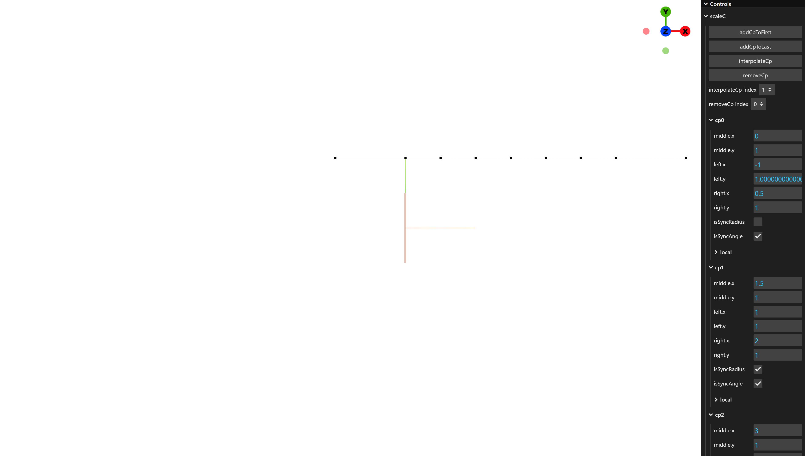

 

Check the "Tube > scaleC > cp0 > isSyncRadius" checkbox. Then, set the value of "Tube > scaleC > cp0 > middle.y" to 0, set the value of "Tube > scaleC > cp0 > local > left.radius" to 0.75, and set the value of "Tube > scaleC > cp0 > local > left.angle" to 270. As a result, the tube cross-section gradually tapers from the center toward the top.

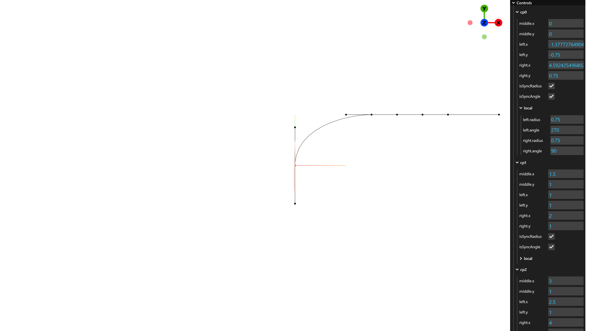

 

Set the value of "Tube > scaleC > cp1 > local > left.radius" to 0.75 for a more gradual taper.

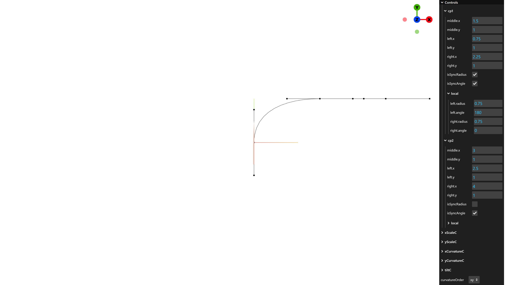

 

Check the "Tube > scaleC > cp2 > isSyncRadius" checkbox. Then, set the value of "Tube > scaleC > cp2 > middle.y" to 0, set the value of "Tube > scaleC > cp2 > local > left.radius" to 0.75, and set the value of "Tube > scaleC > cp2 > local > left.angle" to 90. As a result, the tube cross-section gradually tapers from the center toward the bottom.

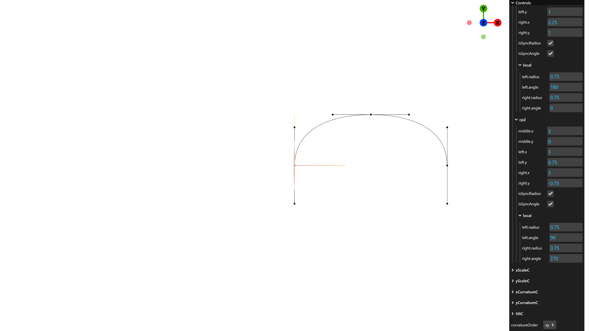

 

Roll the mouse wheel to return to the default zoom level. Uncheck the "TubeGroup > visible > scaleC" checkbox to hide the scale curve for the tube cross-section. Check the "TubeGroup > visible > axis" checkbox to display the tube axis curve.

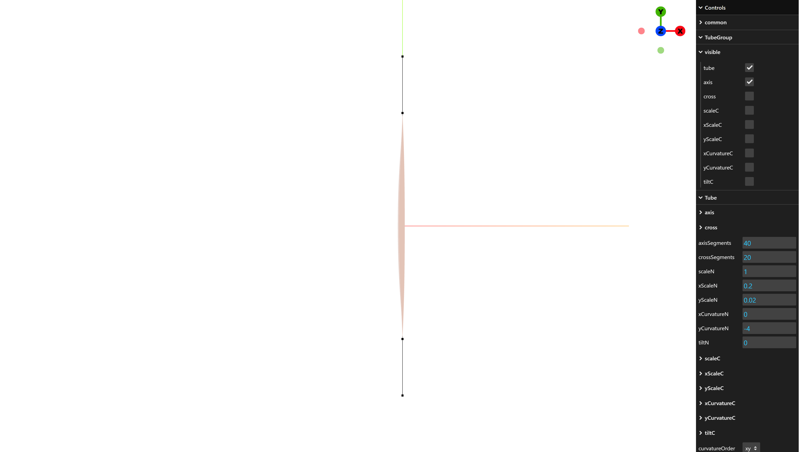

 

Set the value of "Tube > axis > cp0 > local > left.radius" to 0.5 and set the value of "Tube > axis > cp0 > local > left.Az" to 180. As a result, the tube bulges from the top toward the right.

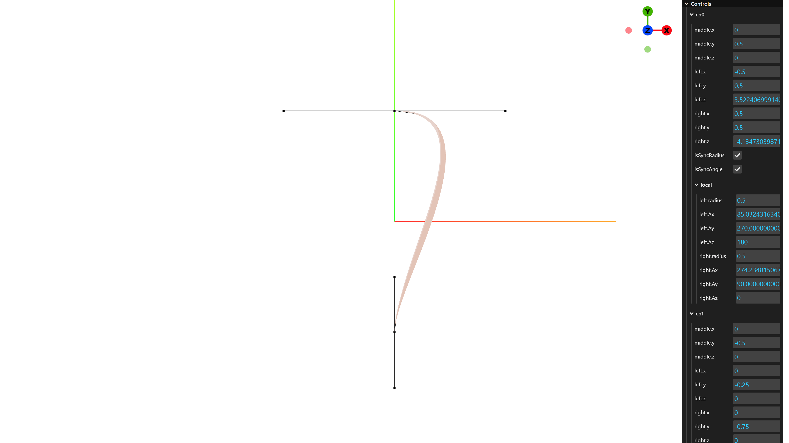

 

Set the value of "Tube > axis > cp1 > local > left.radius" to 0.3 to smoothly connect the curve to the bottom.

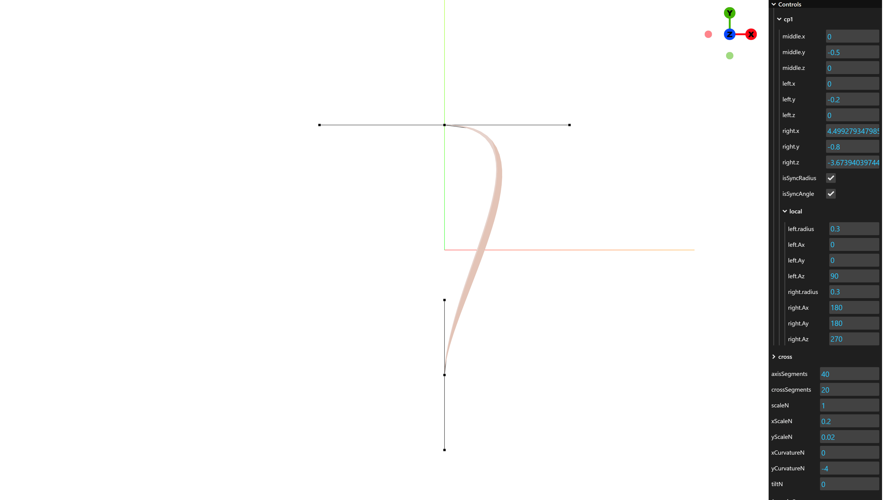

 

Uncheck the "TubeGroup > visible > axis" checkbox to hide the tube axis curve. Now your simple hair bundle is complete.

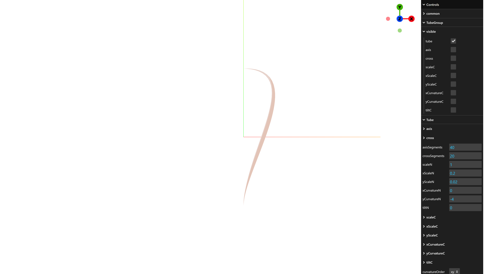

 

View from the +x direction:

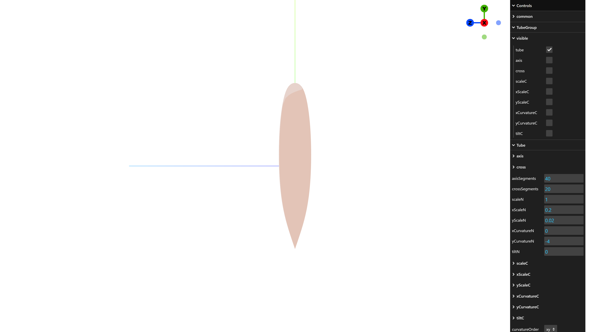
