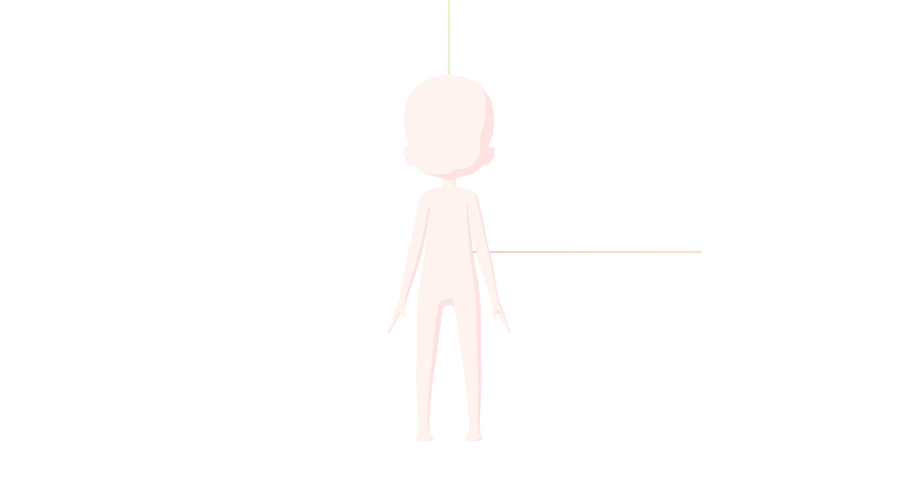
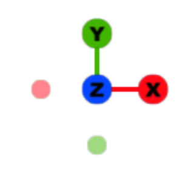
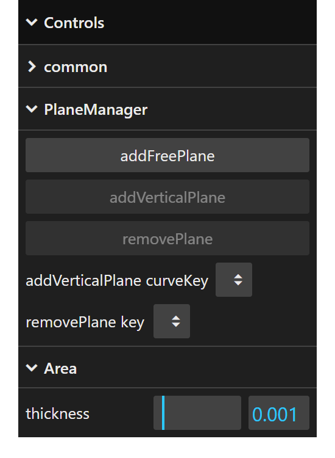

[English](guide.md) | [日本語](guide.jp.md)

# Guide

The tight clothing web page consists of three parts: Scene, Viewport gizmo, and Control panel.

## Scene

[Scene](https://threejs.org/docs/#Scene) is where 3D objects are placed. By default, a human body three heads tall and [AxesHelper](https://threejs.org/docs/#AxesHelper) are placed in the scene. The scene is rendered through [OrthographicCamera](https://threejs.org/docs/#OrthographicCamera). The camera's field of view is adjusted to match the window size. You can control the camera as follows:

- Drag the left mouse button to rotate around the pivot point. The camera always points towards the pivot point. By default, the pivot point is the origin.
- Drag the right mouse button to move parallel to the screen.
- Roll the mouse wheel to zoom in/out.

These camera controls come from [OrbitControls](https://threejs.org/docs/#OrbitControls).

## Viewport gizmo

The viewport gizmo is a library called [THREE Viewport Gizmo](https://fennec-hub.github.io/three-viewport-gizmo/). The viewport gizmo displays the XYZ directions. Clicking on the X,Y,Z circles or the blank -X,-Y,-Z circles will rotate the camera in that direction, just like dragging the left mouse button in the scene.

## Control panel

The control panel is a library called [lil-gui](https://lil-gui.georgealways.com/). The control panel consists of folders and controllers. A folder can contain folders and controllers. Clicking a folder opens or closes it, showing or hiding its contents. A controller can be a dropdown, checkbox, text field, number field, color field, or button.

Number fields can also be modified by dragging the left mouse button or by pressing the up or down arrow keys when the field has focus. While making changes using these methods, holding down the Shift key increases the value step size, and holding down the Alt key decreases the value step size.

Every time you operate the control panel, its current state is saved in a state array. To revert to the previous state, press Ctrl+z (Cmd+z on Mac). To advance to the next state, press Shift+Ctrl+z or Ctrl+y (Shift+Cmd+z or Cmd+y on Mac).

The control panel contains the following items.

| Name                             | Description |
| -------------------------------- | ----------- |
| common                           | Shareable items. |
| --THREE.Scene                    | A scene in which to place 3D objects. Link: https://threejs.org/docs/#Scene |
| ----background                   | The background color of the scene. |
| --THREE.AxesHelper               | Axes helper with XYZ axes. Link: https://threejs.org/docs/#AxesHelper |
| ----visible                      | Whether to display the axes helper. |
| ----size                         | The length of each line for the axes helper. Step: 0.01 |
| --PlaneHelper                    | Moveable plane helper. Link: https://threejs.org/docs/#PlaneHelper |
| ----visible                      | Whether to display all plane helpers. |
| ----size                         | The size of all plane helpers. Step: 0.01 |
| ----color                        | The color of all plane helpers. |
| --THREE.ArrowHelper              | Arrow helper. Link: https://threejs.org/docs/#ArrowHelper |
| ----visible                      | Whether to display all arrow helpers. |
| ----length                       | The length of all arrow helpers. Step: 0.01 |
| ----color                        | The color of all arrow helpers. |
| --THREE.Material                 | The appearance of 3D objects. Link: https://threejs.org/docs/#Material |
| ----body (u=uniforms)            | The appearance of human body object. This is an original mesh toon material created from a shader material. Link: https://threejs.org/docs/#ShaderMaterial |
| ------wireframe                  | Whether to change the human body display to wireframe. |
| ------u.checkShape               | Whether to change the human body display to see the human body shape. As the face turns from front to back, the color changes from white to black. |
| ------u.light.x                  | The x-coordinate of the light source for the human body. Step: 0.1 |
| ------u.light.y                  | The y-coordinate of the light source for the human body. Step: 0.1 |
| ------u.light.z                  | The z-coordinate of the light source for the human body. Step: 0.1 |
| ------u.threshold                | The shade threshold for the human body. The larger this value, the larger the area filled with the shade color. Min: 0, Max: 1, Step: 0.01 |
| ------u.baseColor                | The base color for the human body. |
| ------u.shadeColor               | The shade color for the human body. |
| ----area (u=uniforms)            | The appearance of area object that form tight clothing. This is an original mesh toon material created from a shader material. The folder structure is the same as "body (u=uniforms)" above. Link: https://threejs.org/docs/#ShaderMaterial |
| PlaneManager                     | Manages the increase and decrease of infinite planes. |
| --addFreePlane                   | Adds a free plane, which is an infinite plane with no restrictions on position or orientation. The plane is visualized using the plane and arrow helper. |
| --addVerticalPlane               | Adds the vertical plane specified by "addVerticalPlane curveKey", which is an infinite plane perpendicular to the curve at position u. The plane is visualized using the plane and arrow helper. |
| --removePlane                    | Removes the plane specified by "removePlane key". |
| --addVerticalPlane curveKey      | Curve key to add a vertical plane. |
| --removePlane key                | Key to remove the plane. |
| --plane[0] {FreePlane}           | A free plane, which is an infinite plane with no restrictions on position or orientation. The plane is visualized using the plane and arrow helper. The index (0,1,...) is common to both the free and vertical planes. |
| ----normal                       | Normal direction of the free plane. |
| ------x                          | The x-coordinate of the normal. Changing this will normalize the normal. Step: 0.01 |
| ------y                          | The y-coordinate of the normal. Changing this will normalize the normal. Step: 0.01 |
| ------z                          | The z-coordinate of the normal. Changing this will normalize the normal. Step: 0.01 |
| ----point                        | Reference point for the free plane. |
| ------x                          | The x-coordinate of the point. Step: 0.01 |
| ------y                          | The y-coordinate of the point. Step: 0.01 |
| ------z                          | The z-coordinate of the point. Step: 0.01 |
| ----inverted                     | Whether to invert the normal of the free plane internally. |
| --plane[1] torso {VerticalPlane} | A vertical plane, which is an infinite plane perpendicular to the curve at position u. The plane is visualized using the plane and arrow helper. The index (0,1,...) is common to both the free and vertical planes. The name includes the specified "addVerticalPlane curveKey", such as "torso". |
| ----u                            | The numeric position within the specified "addVerticalPlane curveKey" curve. This is used to calculate a point/normal on the vertical plane. Min: 0, Max: 1, Step: 0.01 |
| ----inverted                     | Whether to invert the normal of the vertical plane internally. |
| Area                             | Relates to tight clothing area. Calculates the intersections of the body with the plane and finds loops within the intersections. Duplicates the body, cuts it using the intersection loops, finds the area adjacent to the intersection loops in the plane normal direction, and gives thickness to that area. |
| --thickness                      | The thickness of the area. Min: 0, Max: 0.01, Step: 0.0001 |
| --intersection loops...          | Loops within the intersections of the body and the plane. The text after "intersection loops" is the same as the text after "plane" in the plane above. |
| ----option                       | How to select the intersection loops. "all" selects all loops. "including plane" selects the loop closest to the plane point. "excluding plane" selects all loops except the loop closest to the plane point. "some" selects the loops at the specified indices. Default: "all" for the free plane, "including plane" for the vertical plane |
| ----indices                      | The indices of the intersection loops. This is only visible if the "some" option is selected. |
| ------0                          | Whether to enable this index (0,1,...). |
