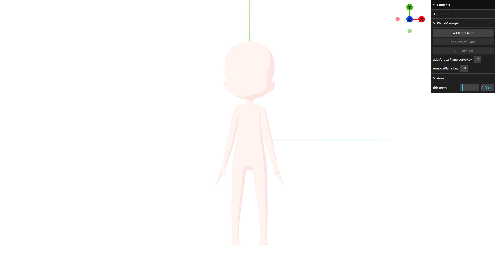
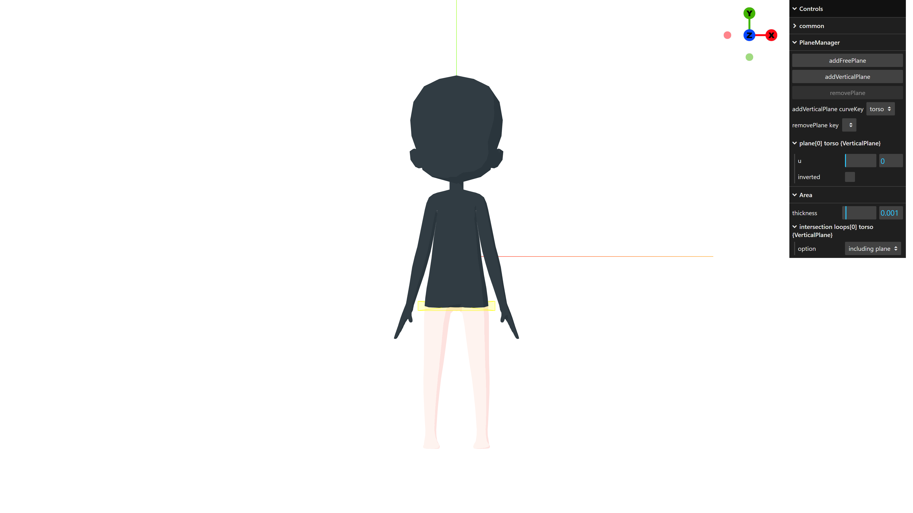
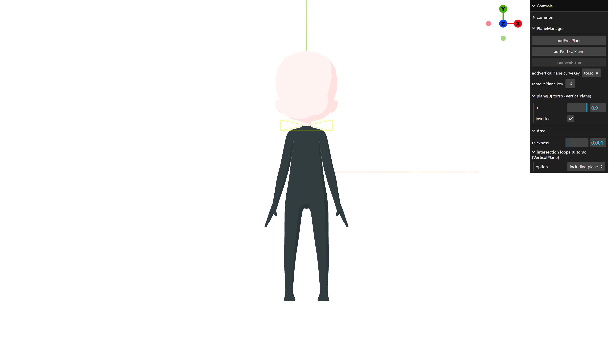
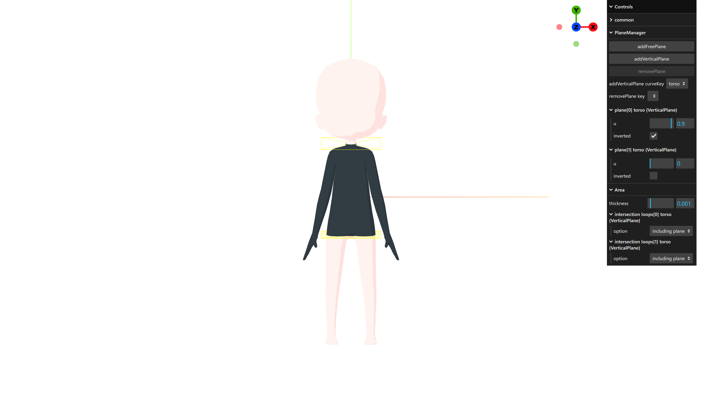
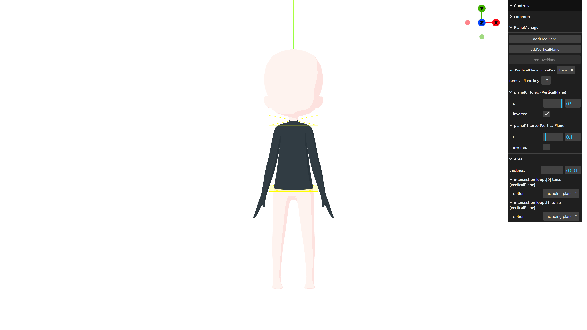
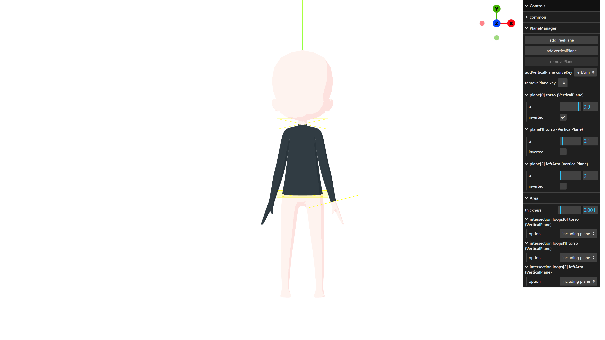
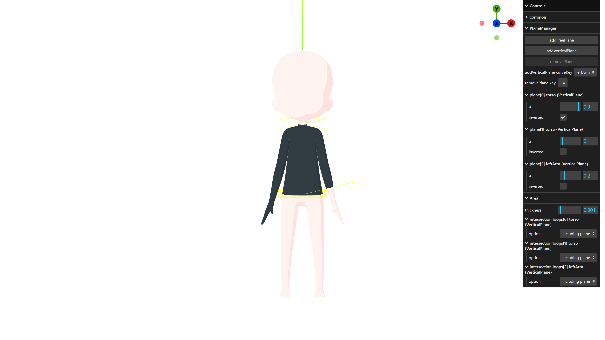
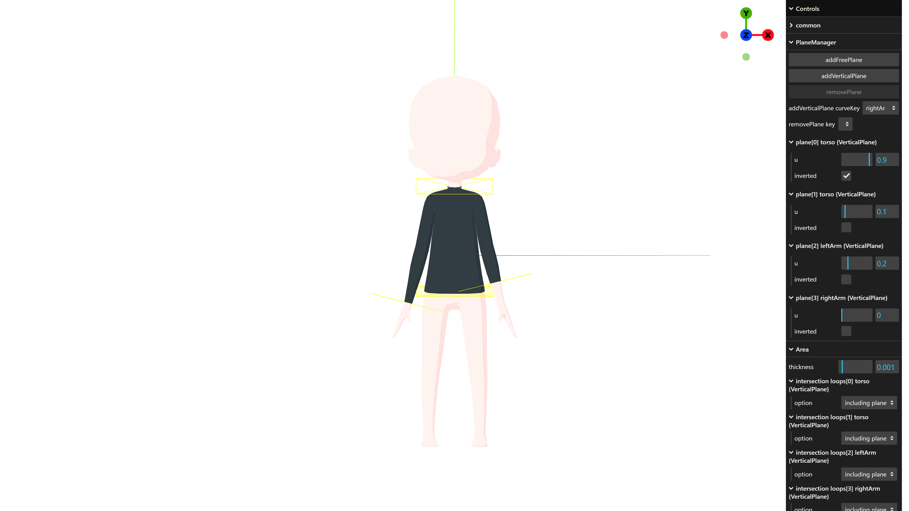
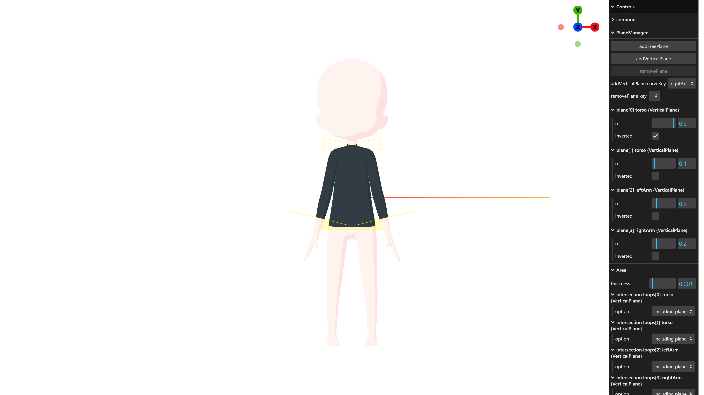
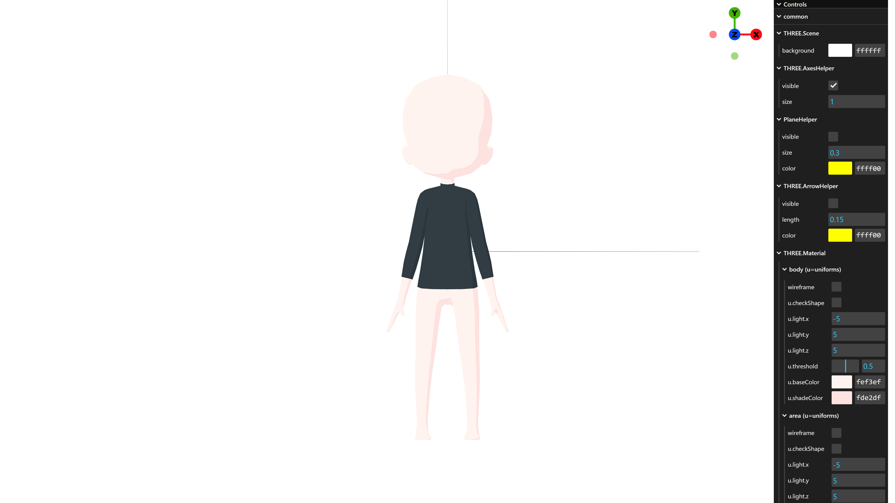

[English](tutorial.md) | [日本語](tutorial.jp.md)

# Tutorial

This tutorial will show you how to create a tight three-quarter sleeve top on the tight clothing web page.

First, open [the tight clothing web page](https://nut753908.github.io/costume-design/tight-clothing.html) in a new tab or new window. You will see a screen like this:

In the "PlaneManager > addVerticalPlane curveKey" dropdown, select "torso". Then, select the "PlaneManager > addVerticalPlane" button to create a vertical plane that moves along the torso curve.

Check the "PlaneManager > plane[0] torso {VerticalPlane} > inverted" checkbox to invert the plane's orientation. Next, set the value of "PlaneManager > plane[0] torso {VercicalPlane} > u" to 0.9 to move the plane to the neck position.

Similarly, select "torso" in the "PlaneManager > addVerticalPlane curveKey" dropdown. Then, select the "PlaneManager > addVerticalPlane" button to create a vertical plane that moves along the torso curve.

Set the value of "PlaneManager > plane[1] torso {VercicalPlane} > u" to 0.1 to move the plane to the position of the lower abdomen.

In the "PlaneManager > addVerticalPlane curveKey" dropdown, select "leftArm". Then, select the "PlaneManager > addVerticalPlane" button to create a vertical plane that moves along the curve of the left arm.

Set the value of "PlaneManager > plane[2] leftArm {VercicalPlane} > u" to 0.2 to move the plane to the three-quarter sleeve position.

In the "PlaneManager > addVerticalPlane curveKey" dropdown, select "rightArm". Then, select the "PlaneManager > addVerticalPlane" button to create a vertical plane that moves along the curve of the right arm.

Set the value of "PlaneManager > plane[3] rightArm {VercicalPlane} > u" to 0.2 to move the plane to the three-quarter sleeve position.

Set the value of "Area > thickness" to 0.002 to make the area a little thicker.

Finally, uncheck the "common > PlaneHelper > visible" and "common > THREE.ArrowHelper > visible" checkboxes to hide the helpers. Now your tight three-quarter sleeve top is complete.

